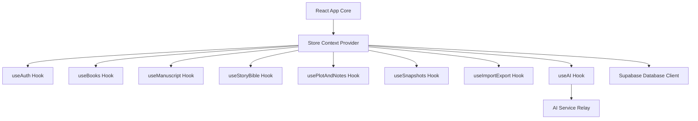

# NovelSynth

NovelSynth is an interactive, cloud-backed collaborative manuscript editor and writing studio designed for novelists and screenwriters. It is integrated with active AI coaching tools, story bible references, timeline consistency checker metrics, and version snapshots.

---

## Technical Stack & Architecture

- **Frontend**: React (v19) + TypeScript + Vite
- **Database & Sync**: Supabase (Real-time Cloud Sync)
- **AI Engine**: Gemini, OpenAI, & OpenRouter via secure API relays



---

## File Structure

The project maintains a modular, decoupled file structure for codebase maintainability:

* **/src/components**:
  - [Editor.tsx](file:///c:/Users/rayfl/Downloads/NovelSynth/src/components/Editor.tsx): The main manuscript markdown/text writing area (focus mode, typewriter mode, word counts).
  - [LeftSidebar.tsx](file:///c:/Users/rayfl/Downloads/NovelSynth/src/components/LeftSidebar.tsx): Outline browser tree, Story Bible navigator, and scrapbook notes list.
  - [RightSidebar.tsx](file:///c:/Users/rayfl/Downloads/NovelSynth/src/components/RightSidebar.tsx): Multi-tab AI panel (Revision diff panels, continuity warnings, dialogue consistency scans, pacing suggestions, research assistant search, and in-context LLM chat).
  - [SearchPanel.tsx](file:///c:/Users/rayfl/Downloads/NovelSynth/src/components/SearchPanel.tsx): Full-text scene search.
  - [VersionHistory.tsx](file:///c:/Users/rayfl/Downloads/NovelSynth/src/components/VersionHistory.tsx): Chronological snapshot listing.
* **/src/services**:
  - [supabaseClient.ts](file:///c:/Users/rayfl/Downloads/NovelSynth/src/services/supabaseClient.ts): Supabase client instantiation with Proxy fallbacks to avoid crashes when keys are empty.
  - [aiService.ts](file:///c:/Users/rayfl/Downloads/NovelSynth/src/services/aiService.ts): Context prompt mapping and API calls to Gemini, OpenAI, or OpenRouter.
* **/src/store**:
  - [storeTypes.ts](file:///c:/Users/rayfl/Downloads/NovelSynth/src/store/storeTypes.ts): Holds the `StoreContextType` interface.
  - [index.tsx](file:///c:/Users/rayfl/Downloads/NovelSynth/src/store/index.tsx): Root state provider combining all hooks.
  - **/hooks**: Dedicated, isolated files handling specific business operations:
    - [useAuth.ts](file:///c:/Users/rayfl/Downloads/NovelSynth/src/store/hooks/useAuth.ts): Supabase auth state change lifecycle listeners.
    - [useBooks.ts](file:///c:/Users/rayfl/Downloads/NovelSynth/src/store/hooks/useBooks.ts): Book projects listing, loading, settings configurations, and cleanup.
    - [useManuscript.ts](file:///c:/Users/rayfl/Downloads/NovelSynth/src/store/hooks/useManuscript.ts): Chapters outline mapping, scene text changes, and debounced Supabase saves.
    - [useStoryBible.ts](file:///c:/Users/rayfl/Downloads/NovelSynth/src/store/hooks/useStoryBible.ts): Creation & editing of characters, locations, factions, and power systems.
    - [usePlotAndNotes.ts](file:///c:/Users/rayfl/Downloads/NovelSynth/src/store/hooks/usePlotAndNotes.ts): Plot threads status and debounced note scrapbook saving.
    - [useSnapshots.ts](file:///c:/Users/rayfl/Downloads/NovelSynth/src/store/hooks/useSnapshots.ts): Version history capture and rollback.
    - [useImportExport.ts](file:///c:/Users/rayfl/Downloads/NovelSynth/src/store/hooks/useImportExport.ts): JSON backup import and export engines.
    - [useAI.ts](file:///c:/Users/rayfl/Downloads/NovelSynth/src/store/hooks/useAI.ts): Interactive chat feed, context engine compilation, and prompt calls.

---

## Database Schema (Supabase)

NovelSynth reads and writes to the following Supabase tables:

1. **books**: User project settings, name, and provider configurations.
2. **chapters**: Outline folders with indices.
3. **scenes**: Individual section text,POV metadata, dates, and locations.
4. **story_bible_items**: Sheet profiles for characters, locations, factions, and systems.
5. **plot_threads**: Promoted plot arcs and resolutions.
6. **notes**: Flat-file scrapbook thoughts.
7. **memory_updates**: Auto-generated scene summaries used to append character history.
8. **snapshots**: Historical scene revisions.

---

## Getting Started

### Prerequisites

Create a `.env` file in the project root:
```env
VITE_SUPABASE_URL=your_supabase_url
VITE_SUPABASE_ANON_KEY=your_supabase_anon_key
```

### Installation

```bash
# Install packages
npm install

# Run the development server
npm run dev

# Run linting
npm run lint

# Build production bundle
npm run build
```
